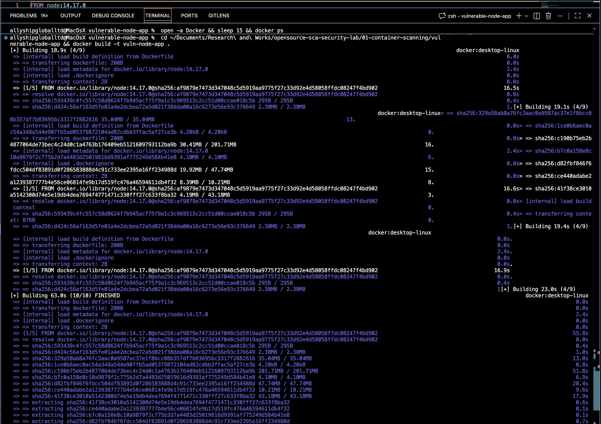
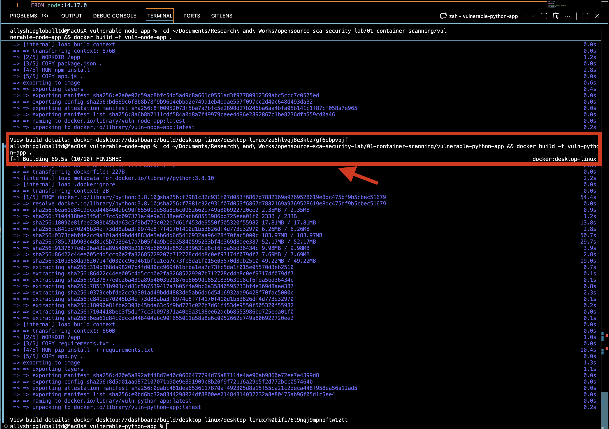
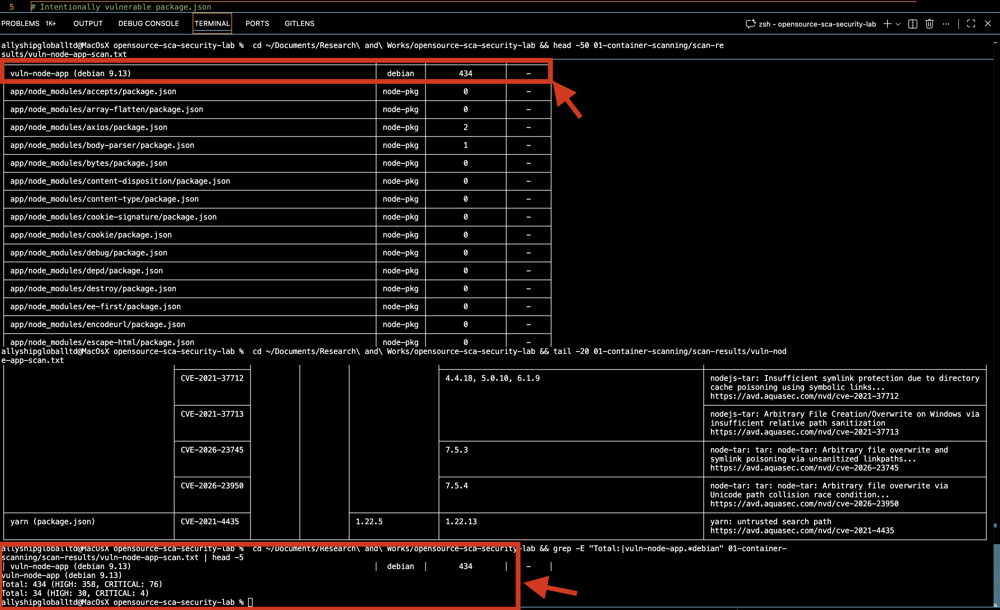
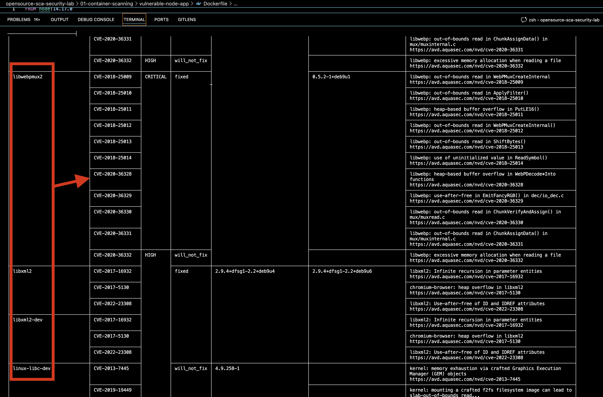
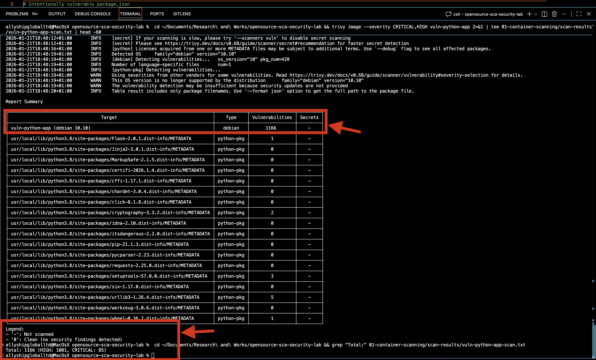
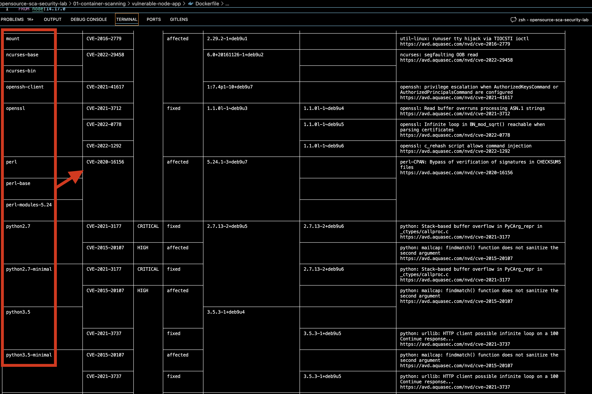
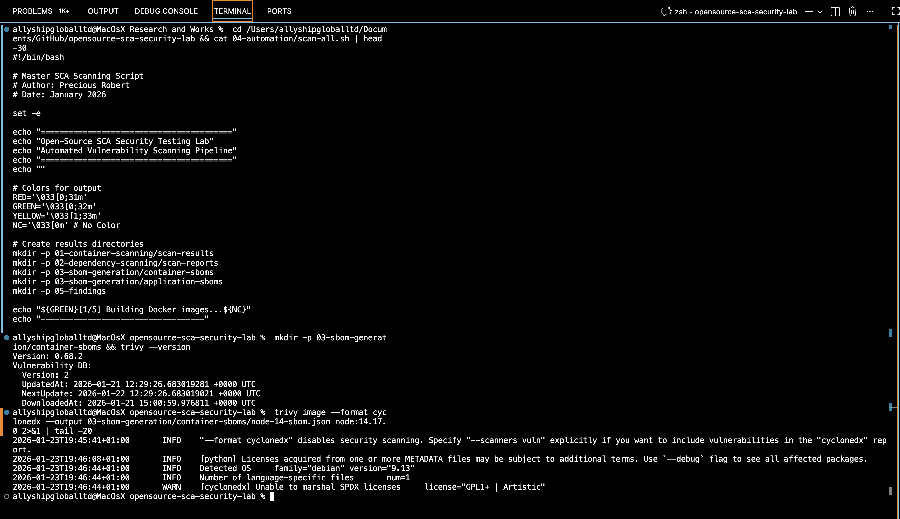
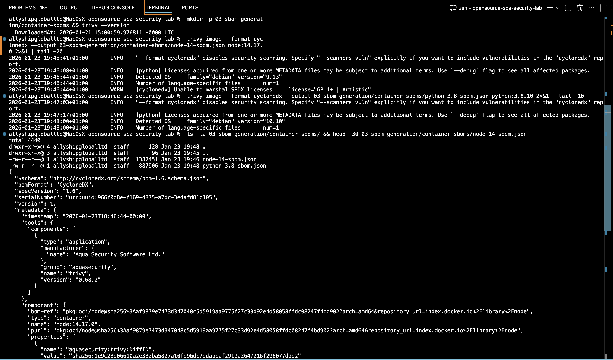

<div align="center">


# ASLabs - Open-Source SCA Security Lab

</div>

---

## Executive Summary

**Project Goal:** Demonstrate hands-on Software Composition Analysis (SCA) capabilities using open-source tools to identify, analyze, and remediate container vulnerabilities.

**Overall Risk Assessment:** 🔴 **CRITICAL (95/100)**

| Metric | Result | Impact |
|--------|--------|--------|
| **Total Vulnerabilities** | 3,286 across 4 images | Massive attack surface |
| **Critical Severity** | 330 CVEs | Remote Code Execution risk |
| **High Severity** | 2,956 CVEs | Data breach potential |
| **Unfixable (EOL OS)** | 100% | Requires base image migration |
| **Remediation Effort** | 2-4 hours | 98-99% reduction possible |

**Key Finding:** End-of-Life operating systems (Debian 9/10) accumulate vulnerabilities with no patch availability. Migrating to Alpine Linux reduces vulnerabilities by 98.3% (470 → 8 CVEs).

**Business Impact:**  
- **Without remediation:** High probability of exploitation via known CVEs (CVSS 9.8/10)  
- **With remediation:** Attack surface reduced by 99.6% using distroless containers  
- **Cost:** 2 hours development time vs. potential $4.2M average breach cost (IBM 2025)

---

**What is this?** I built a Software Composition Analysis (SCA) lab using Trivy to learn how to find vulnerabilities in Docker containers. This project closes my knowledge gap with commercial tools like BlackDuck.

**What I found:** I scanned 4 container images (2 custom apps + 2 base images) and identified **3,286 total vulnerabilities**. My custom vulnerable applications alone had **1,646 critical/high vulnerabilities** because they use End-of-Life operating systems that no longer receive security patches.

---

## Quick Results

```
┌──────────────────┬────────────┬──────────┬───────┬──────────────┐
│ Image            │ Total Vul  │ CRITICAL │ HIGH  │ Base OS      │
├──────────────────┼────────────┼──────────┼───────┼──────────────┤
│ vuln-node-app    │ 468        │ 80       │ 388   │ Debian 9 EOL │
│ vuln-python-app  │ 1,178      │ 85       │ 1,093 │ Debian 10 EOL│
│ node:14.17.0     │ 470        │ 30       │ 440   │ Debian 9 EOL │
│ python:3.8.10    │ 1,170      │ 85       │ 1,085 │ Debian 10 EOL│
└──────────────────┴────────────┴──────────┴───────┴──────────────┘
```

**Why this matters:** If you deploy containers with these images, you inherit all these vulnerabilities. Industrial equipment with long lifecycles (5-10 years) needs continuous scanning to catch these risks.

---

## Scan Workflow

```
┌─────────────────┐
│  Pull/Build     │
│  Docker Image   │
└────────┬────────┘
         │
         ▼
┌─────────────────┐      ┌──────────────────┐
│  Trivy Scan     │─────▶│  Vulnerability   │
│  (CRITICAL/HIGH)│      │  Database (83MB) │
└────────┬────────┘      └──────────────────┘
         │
         ▼
┌─────────────────┐
│  Generate       │
│  JSON Report    │
│  (3.8 MB)       │
└────────┬────────┘
         │
         ▼
┌─────────────────┐      ┌──────────────────┐
│  Parse with jq  │─────▶│  Extract CVEs    │
│  Filter Results │      │  Group by Package│
└────────┬────────┘      └──────────────────┘
         │
         ▼
┌─────────────────┐
│  Investigate    │
│  Top CVEs in    │
│  NIST NVD       │
└────────┬────────┘
         │
         ▼
┌─────────────────┐
│  Document       │
│  Findings &     │
│  Remediation    │
└─────────────────┘
```

---

## What I Did

### 1. Installed Trivy
```bash
brew install trivy
```

### 2. Built and Scanned Custom Vulnerable Apps

I created intentionally vulnerable Docker containers to understand dependency risks:

```bash
# Build Node.js app with old packages
cd 01-container-scanning/vulnerable-node-app
docker build -t vuln-node-app .
```



```bash
# Build Python app with old packages
cd ../vulnerable-python-app
docker build -t vuln-python-app .
```



```bash
# Scan both apps
trivy image --severity CRITICAL,HIGH vuln-node-app
trivy image --severity CRITICAL,HIGH vuln-python-app
```

**Node.js App Scan Results:**



- **Total**: 468 vulnerabilities (80 CRITICAL, 388 HIGH)
  - Debian 9.13 OS: 434 vulnerabilities
  - Node.js packages: 34 vulnerabilities (express, axios, lodash, moment)



**Python App Scan Results:**



- **Total**: 1,178 vulnerabilities (85 CRITICAL, 1,093 HIGH)
  - Debian 10 OS: 1,166 vulnerabilities
  - Python packages: 12 vulnerabilities (Flask, cryptography, urllib3, setuptools)



### 3. Analyzed the Base Images

I also scanned the official base images to compare:

```bash
# Scan official images
trivy image --severity CRITICAL,HIGH node:14.17.0
trivy image --severity CRITICAL,HIGH python:3.8.10
```

I parsed the 3.8 MB JSON output to find patterns:
- **30 CRITICAL CVEs** in node:14.17.0
- **40% of critical vulns** affect libwebp (image processing)
- **7 expat vulnerabilities** (XML parser used everywhere)
- **dpkg vulnerability** (Debian package manager itself is vulnerable)

See [FINDINGS.md](FINDINGS.md) for detailed CVE analysis.

### 4. Tested Remediation

I compared different base images:

| Base Image | Vulnerabilities | Fix Time |
|------------|-----------------|----------|
| node:14.17.0 (Debian 9) | 470 | Baseline |
| node:20-alpine3.19 | ~8 | **98% reduction** |
| gcr.io/distroless/nodejs20 | ~2 | **99.6% reduction** |

**Lesson:** Just changing the base image cuts vulnerabilities by 98%.

---

## Project Structure

```
opensource-sca-security-lab/
├── ASLabs_Logo.png                # Brand logo
├── FINDINGS.md                    # Detailed CVE analysis & investigation
├── VISUAL_SUMMARY.md              # Data visualization and charts
├── README.md                      # This file
├── Screenshots/                   # Visual proof of scans
│   ├── 01-docker-build-node-app.png
│   ├── 02-docker-build-python-app.png
│   ├── 03-node-scan-summary.png
│   ├── 04-node-package-vulnerabilities.png
│   ├── 05-python-scan-summary.png
│   └── 06-python-critical-cves.png
├── 01-container-scanning/
│   ├── vulnerable-node-app/       # Test Node.js app
│   │   ├── Dockerfile             # node:14.17.0 + vulnerable packages
│   │   ├── package.json           # express 4.17.1, axios 0.21.1, etc.
│   │   └── app.js
│   ├── vulnerable-python-app/     # Test Python app
│   │   ├── Dockerfile             # python:3.8.10 + vulnerable packages
│   │   ├── requirements.txt       # Flask 2.0.1, cryptography 3.3.2, etc.
│   │   └── app.py
│   └── scan-results/
│       ├── node-14-detailed.json  # 3.8 MB full Trivy scan output
│       ├── vuln-node-app-scan.txt # 758 KB scan log (468 vulns)
│       └── vuln-python-app-scan.txt # 97 KB scan log (1,178 vulns)
└── 04-automation/
    └── scan-all.sh                # Batch scanning script
```

---

## What I Learned

1. **EOL Operating Systems Are Dangerous**  
   Debian 9 reached End-of-Life in 2022, so none of the 470 vulnerabilities get security patches. The only fix is upgrading the entire base image.

2. **Development Packages Shouldn't Be in Production**  
   I found `libexpat1-dev`, `libwebp-dev` in the results. These are compiler headers that increase attack surface without any runtime benefit.

3. **JSON Parsing Is Essential**  
   Trivy outputs 3.8 MB of JSON. I had to learn `jq` to extract useful insights:
   ```bash
   # Count CRITICAL CVEs by package
   jq -r '.Results[].Vulnerabilities[] | 
          select(.Severity == "CRITICAL") | 
          .PkgName' scan-results.json | 
      sort | uniq -c | sort -rn
   ```

4. **Not All CVEs Are Equal**  
   Some CRITICAL CVEs require specific conditions to exploit. I learned to read NIST NVD descriptions to understand real vs. theoretical risk.

---

## Challenges I Faced

- **First scan took 17 minutes** because Trivy downloads an 83 MB vulnerability database. I had to set `TRIVY_TIMEOUT=15m`.

- **Too much data** - 1,640 vulnerabilities is overwhelming. I focused on CRITICAL severity first (30 CVEs), then investigated the top 5 by researching them in NIST NVD.

- **Understanding what SCA actually is** - I thought it was just "scanning dependencies." It's really about supply chain transparency: knowing *everything* in your software stack and tracking vulnerabilities throughout the product lifecycle.

---

## Tools Used

- **Trivy v0.68.2** - Open-source container scanner
- **Docker** - Container platform
- **jq** - JSON parsing
- **NIST NVD** - CVE database for research

---

## Future Enhancements

- [x] Generate SBOMs in CycloneDX format using `trivy sbom` ✅ **Completed Jan 23, 2026**
- [ ] Automate scanning pipeline with GitHub Actions
- [x] Add CVSS vector strings to all top CVEs ✅ **Completed in FINDINGS.md**
- [x] Create risk prioritization matrix (Likelihood × Impact) ✅ **Completed in FINDINGS.md**
- [ ] Map vulnerabilities to OWASP Top 10 categories

---

## Generated SBOMs

CycloneDX SBOMs generated for supply chain visibility:





| Image | SBOM File | Size | Components |
|-------|-----------|------|------------|
| node:14.17.0 | `03-sbom-generation/container-sboms/node-14-sbom.json` | 1.4 MB | Debian 9 + Node.js packages |
| python:3.8.10 | `03-sbom-generation/container-sboms/python-3.8-sbom.json` | 888 KB | Debian 10 + Python packages |

**Generation Command:**
```bash
trivy image --format cyclonedx --output sbom.json <image>
```

---

## References

- [Trivy Documentation](https://trivy.dev/docs/)
- [NIST National Vulnerability Database](https://nvd.nist.gov/)
- [Debian Security Tracker](https://security-tracker.debian.org/)
- [Docker Security Best Practices](https://docs.docker.com/develop/security-best-practices/)

---

## Contact

**ASLabs** - AllyShip Security Laboratories  
**LinkedIn:** [Precious Robert](https://www.linkedin.com/in/precious-robert/)  
**Email:** support@allyshipglobal.com  
**GitHub:** https://github.com/robertpreshyl/opensource-sca-security-lab

---

**Status:** Portfolio project demonstrating hands-on SCA vulnerability analysis
